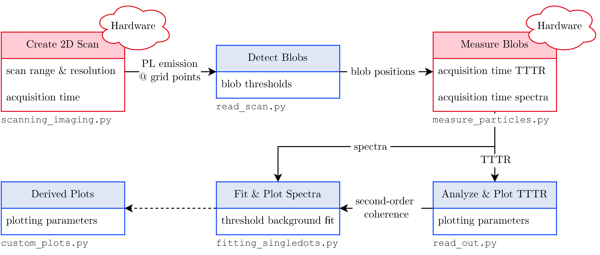

# APD_scanning_imaging
### Authors: Robert Keitel, ??
#### updated for BSc Thesis Julian Santen
Python script that communicates with the MadCityLabs stage and the Hydraharp to perform scanned imaging in TTTR mode

You can run scanning_imaging and edit the settings to make a scan that is saved at the specified location under the specified name.

Watch out: You have to run it in an external console (change in Run - Configuration per file)
It plots the intensity image live row-wise in greyscale and at the end in a nicer way.
DO NOT close these windows, as this has caused the console to crash. When done, close the console

### Work in Progress (New Documentation for BSc Julian Santen)

## Overall Code Flow

* `read_scan.py`
  * analyzes the export from `scanning_imaging.py`
  * creates a 2D image of the scanned sample and finds the position of the bright blobs
  blobs are bright areas in the image and, therefore, potential candidates for PL emission of nanocrystals
  * blob positions are used to perform the actual TCSPC and spectroscopy measurements
  * Parameters
    * `MIN_SIGMA`, `MAX_SIGMA`: corresponds to the minimum and maximum allowed standard deviation for the blob detection
      algorithm. Effectively, a larger maximum sigma corresponds to larger blobs being detected and a larger
      minimum sigma corresponds to smaller dots being discarded.
    * `THRESHOLD`: minimum intensity that a blob needs to have for it to be considered
    * **Note:** Please the check the [proper function definitions](https://scikit-image.org/docs/stable/auto_examples/features_detection/plot_blob.html) of the `blob_log`

### Supporting Scripts not part of the overall measurement process
* Folder: `machine_learning/`
  * Contains a timeseries classification for intensity tracings of MSNC. It requires the corresponding second-order 
    coherence data that is obtained by running the `read_out.py` script. The script fits a  Fully Convolutional Network
    (FCN) to the timeseries data and indicates if a measured position is singular or not. In `machine_learning/trained_models`
    are pre-trained models stored. The model with the highest probability $`P(\text{singular}|\text{predicted singular})`$ is
   `3classes_5out6_23out24out32.h5` with about `95%`. However, the overall probability to detect singular particles is 
   lower compared to `all_points_3_classes.h5`.
