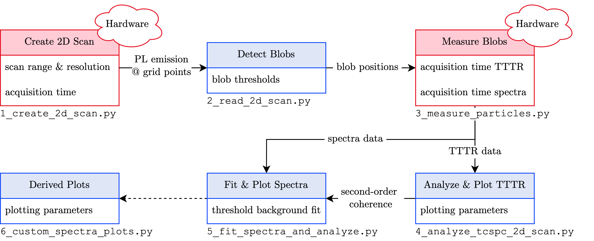

# APD_scanning_imaging
### Main Author: Robert Keitel
### Authors: Julian Santen, Dr. Gabriel Nagamine Gomez
Python script that communicates with the MadCityLabs stage and the Hydraharp to perform scanned imaging in TTTR mode

You can run scanning_imaging and edit the settings to make a scan that is saved at the specified location under the specified name.

Watch out: You have to run it in an external console (change in Run - Configuration per file)
It plots the intensity image live row-wise in greyscale and at the end in a nicer way.
DO NOT close these windows, as this has caused the console to crash. When done, close the console

## Overall Code Flow

### Scripts Time-Tagged Time-Correlated Single-Photon Counting
* `1_create_2d_scan.py` (fka `scanning_imaging.py`)
* `2_read_2d_scan.py` (fka `read_scan.py`)
  * analyzes the export from `1_create_2d_scan.py`
  * creates a 2D image of the scanned sample and finds the position of the bright blobs
  blobs are bright areas in the image and, therefore, potential candidates for PL emission of nanocrystals
  * blob positions are used to perform the actual TCSPC and spectroscopy measurements
  * Parameters
    * `MIN_SIGMA`, `MAX_SIGMA`: corresponds to the minimum and maximum allowed standard deviation for the blob detection
      algorithm. Effectively, a larger maximum sigma corresponds to larger blobs being detected and a larger
      minimum sigma corresponds to smaller dots being discarded.
    * `THRESHOLD`: minimum intensity that a blob needs to have for it to be considered
    * **Note:** Please the check the [proper function definitions](https://scikit-image.org/docs/stable/auto_examples/features_detection/plot_blob.html) of the `blob_log`
* `3_measure_particles.py`
* `4_analyze_tcspc_2d_scan.py`

### Scripts Spectra

**Purpose:** Script to read .asc files generated by Andor Solis. Assuming, that only a single spectrum is contained in 
every .asc file, the scripts perform a peak fit for this spectrum (either Lorentzian or Gaussian). The scripts analyze
all the ASC files in a specified folder.

**Assumptions**
The individual Andor Solis spectrum only contains the spectrum of a single dot in the vertical direction (!)

* `5_fit_spectra_and_analyze.py` (fka `Fitting_SingleDots_lmfit.py`)
  * Script that analyzes the obtained spectra and creates plots for individual measurement days
  * For each provided folder it will create plots and csvs. However, if a comparison between multiple days is wanted
  use the `Custom_Plots.py` script 
* `6_custom_spectra_plots.py` (fka `Custom_Plots.py`)
  * Script that allows the user to compare measurements of multiple days and create boxplots and normal spectra plots
  * The files need to be previously analyzed with the `Fitting_SingleDots_lmfit.py` script
  * **Attention**: Special care needs to be taken when setting the `upper_limit_fwhm` as this is a pre-selection
    on the FWHM! All particles with a FWHM above `upper_limit_fwhm` are discarded
  * Some of the functionalities include for adding an entry (`add_entry`):
    - `group_number`: The group number is used to indicate which measurement days belong together; the spectra will be grouped by this 
        number. The numbers need to be positive integers starting at 1 in a connected intervall:
      - Right: 1 2 3 4 ... 
      - Wrong: 0 1 2 3 ... 
      - Wrong: 1 3 4 5 ...
    - `group_name`: String containing a user-chosen name for the specific group
    - `state`: filter by state
        - state is in `["singular", "non_singular", "discarded"]` these are based on g2 if available    
        - state is in `[True, False]` (careful: boolean values!) these are based on the calculations in Fitting_SingleDots
            and are therefore based on the threshold for chi-squared in that script (most likely: 1)
    - `threshold_chisqr` : filter by chi-squared value: this implements (almost) excactly the same filtering as in the Fitting_SingleDots 
            scripts and can therefore be used to quickly test different thresholds! Values need to be larger than 1
            with sensible values in the range 0.1 - 1.0.
    - `selected_blobs` select specfic spectra: here an array can be entered with the Andor File numbers of spectra one 
        wants to visualize 
    - Plotting Options (these might not always work 100% correctly). These options are mainly for the spectra plots
      - `color`: specifiy any color. The shorthand notation for the colors  `("c", "m", "y", "k", "r", "g", "b")` is mapped
          to match the specified seaborn color palette. It is also possible to provide a hex value. Refer to the official
          documentation
      - `linestyle`: different markers can be selected `("o", "s", "<", ".")`

### Supporting Scripts not part of the overall measurement process
* Folder: `supporting_scripts/machine_learning/`
  * Contains a timeseries classification for intensity tracings of MSNC. It requires the corresponding second-order 
    coherence data that is obtained by running the `read_out.py` script. The script fits a  Fully Convolutional Network
    (FCN) to the timeseries data and indicates if a measured position is singular or not. In `machine_learning/trained_models`
    are pre-trained models stored. The model with the highest probability $`P(\text{singular}|\text{predicted singular})`$ is
   `3classes_5out6_23out24out32.h5` with about `95%`. However, the overall probability to detect singular particles is 
   lower compared to `all_points_3_classes.h5`.
